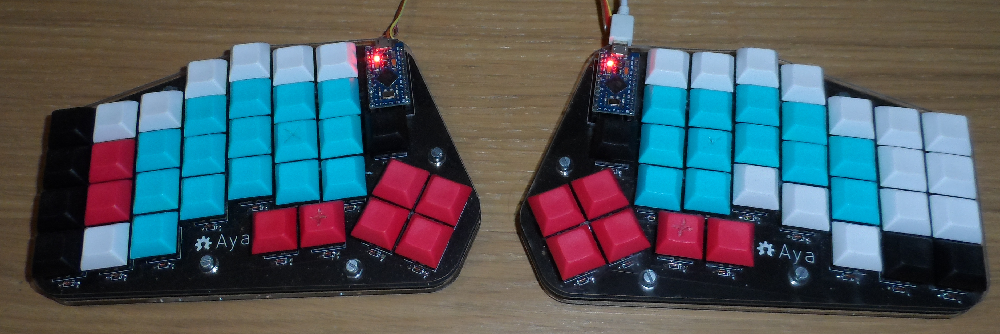

# Aya

Another split keyboard, because the world does not have enough split keyboards.
Very, very inspired by the ErgoDox, but with more keys.

## Hardware configuration

1. Ensure PCB is up to date with schematic
2. `make pcb_layout`
3. File > Import > Import Graphics...
  - File: `pcb_outline.dxf`
  - Placement: At: 0, 0
  - Graphic layer: Edge.Cuts
4. Route PCB
5. `make pcb_split`
6. Export gerbers and drill files for each half
7. `make pcb_gerbers`
